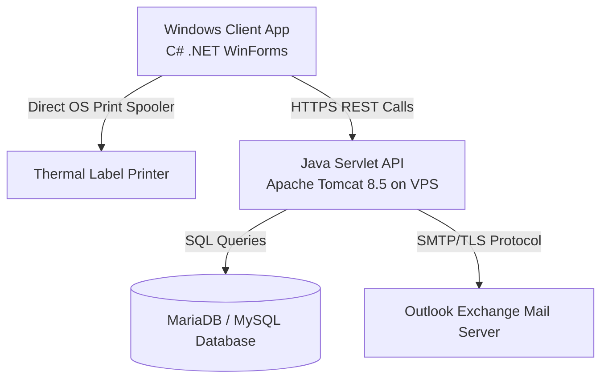

# Yuken PDI (Pre-Dispatch Inspection) Silent Printing System

A hybrid enterprise desktop and web integration system designed to streamline and automate label printing at assembly and Pre-Dispatch Inspection (PDI) workstations. 

This project solves a common hardware integration challenge: Google Chrome's strict security sandbox and **Private Network Access (PNA)** rules block web browsers from communicating directly with local USB thermal printers, forcing operators to click through manual print previews. This system solves that by implementing a native Windows client that integrates with a secure Java Servlet backend on Apache Tomcat.

---

## 🚀 Key Features

* **Silent & Instant Printing:** Generates and spools labels directly to Windows print queues natively, bypassing browser dialogues completely.
* **Hybrid Architecture:** Combines a secure Java web backend (running on Apache Tomcat) with a lightweight, standalone C# (.NET) client for direct hardware integration.
* **Dynamic Label Generation:** Prints company logos, automated timestamps, custom serial numbers, vector-drawn confirmation shapes, and dynamically fetched QR codes.
* **Security & TLS Integration:** Secure communication over HTTPS with certificate validation bypass for private corporate networks.
* **Database Logs & Alerts:** Connects to MariaDB/MySQL to log inspection results by employee and shift, and utilizes SMTP/Outlook mail servers to trigger real-time alerts.

---

## 🛠️ System Architecture

### 1. The C# Windows Desktop Client
* Built using C# and the native Windows Forms API.
* Implements a login screen that authenticates employees by POSTing to the Tomcat servlet and parsing query responses.
* Uses `System.Drawing.Printing.PrintDocument` to draw high-quality labels with precise positioning. It downloads Yuken's logo dynamically and calls a public QR code API to fetch QR data.

### 2. The Java Tomcat Backend
* Runs on Apache Tomcat 8.5 (Java 8 compatible).
* Implements multiple servlets:
  * `LoginServlet`: Authenticates employee credentials against the database.
  * `CheckAssemblyServlet`: Validates if the scanned pump was compiled at the assembly workstation.
  * `SaveResultsServlet`: Saves all inspection entries into the `pdi_inspection` database table.
  * `SendReasonServlet`: Triggers automated Outlook warning emails to supervisors when a barcode fails inspection.

---

## 📂 Database Schema

The system integrates with a MariaDB/MySQL database holding two main tables:

### 1. `pump_testing_station_log_data` (Employees)
* `emp_name` (VARCHAR): Operator Name
* `emp_no` (VARCHAR): Employee ID
* `password` (VARCHAR): Securely hashed password string

### 2. `pdi_inspection` (Inspection Logs)
* `Serial_key` (VARCHAR - Primary Key): Unique UUID for each log
* `Serial_No` (VARCHAR): Scanned barcode data
* `Label` (VARCHAR): Status of printed label
* `emp_name` (VARCHAR): Operator Name
* `emp_no` (VARCHAR): Employee ID
* `shift` (VARCHAR): Operator Shift (General, First, Second, Night)

---

## 💼 Resume / Portfolio Bullet Points

Here is how you can describe this project on your Resume:

* **Enterprise Integration:** *"Designed and developed a hybrid enterprise desktop client (C#) and web API backend (Java Servlets/Tomcat) to automate label printing at assembly lines, increasing workstation productivity by eliminating manual print dialogues."*
* **Network & Security Bypass:** *"Successfully bypassed web browser sandboxes and Google Chrome's Private Network Access (PNA) security blocks by routing print requests through a native Windows print spooler API connected securely to Tomcat over HTTPS."*
* **Database & Mail Automation:** *"Integrated MariaDB database logger for shift tracking and configured SMTP Outlook exchange services to send real-time warning alerts to management when failed quality checks occur."*
